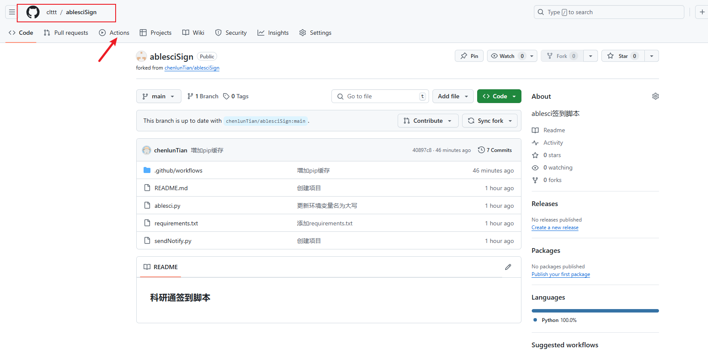
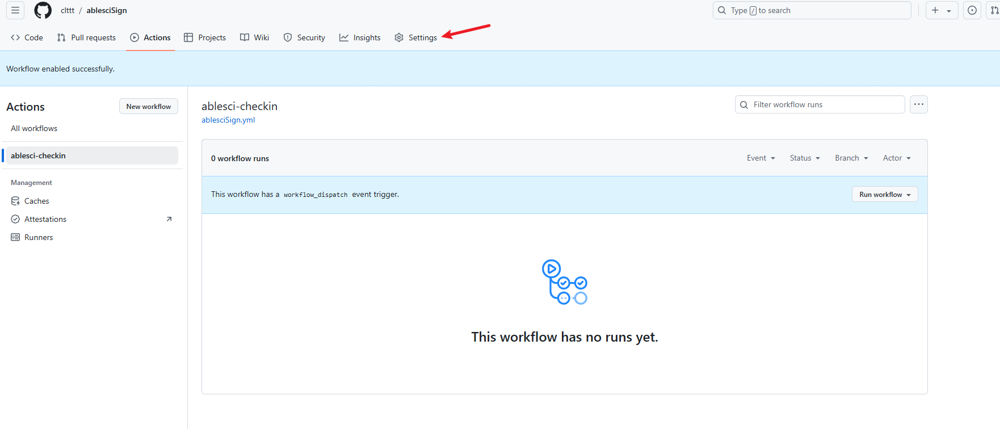
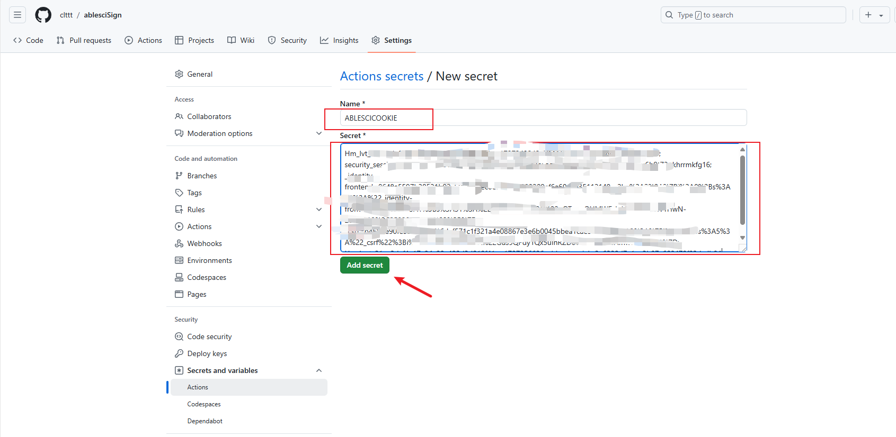
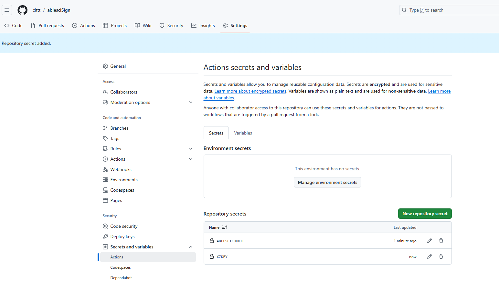
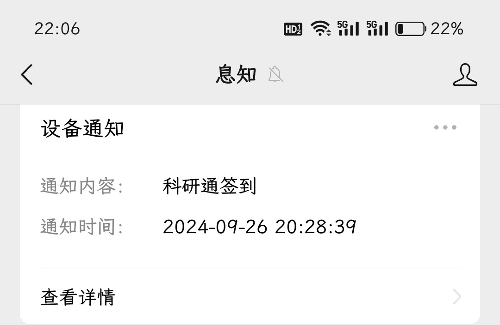
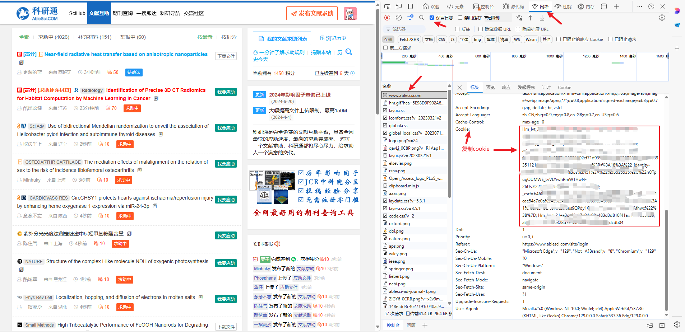
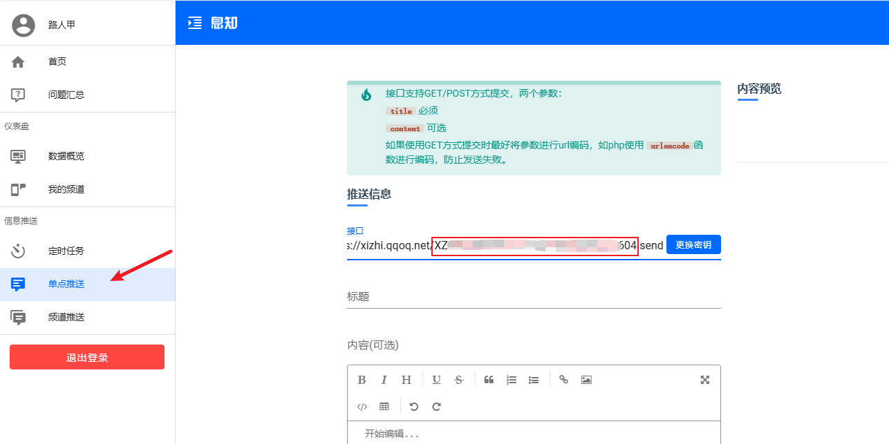
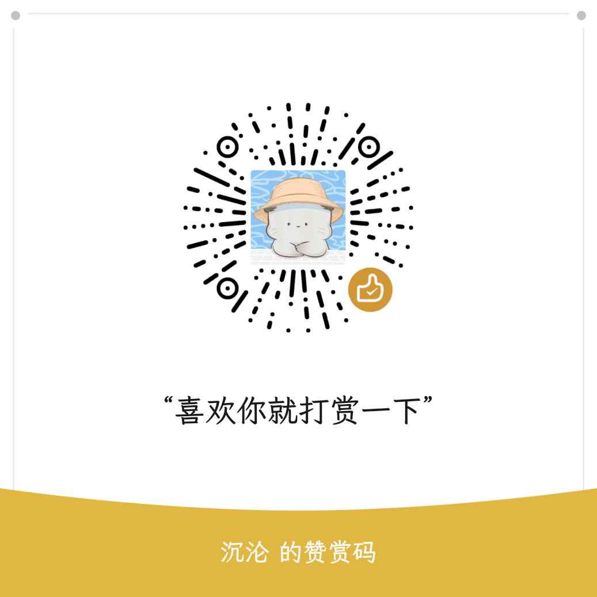

> 可以通过换行添加多个科研通账号的cookie,实现多个账号签到 
> 参考**1.1.5.1多Cookie配置格式**

[TOC]

- [科研通签到脚本](#科研通签到脚本)
- [1.使用教程](#1使用教程)
  - [1.1.方式一 ： Github Actions 部署](#11方式一--github-actions-部署)
      - [1.1.1.注册登录GitHub](#111注册登录github)
      - [1.1.2.Fork项目到自己的Github](#112fork项目到自己的github)
      - [1.1.3.点击 Fork](#113点击-fork)
      - [1.1.4.在自己Fork的项目中启用Actions](#114在自己fork的项目中启用actions)
      - [1.1.5.配置环境变量](#115配置环境变量)
        - [1.1.5.1 多Cookie配置：](#1151-多cookie配置)
        - [1.1.5.2.推送服务配置](#1152推送服务配置)
        - [1.1.5.2.添加科研通cookie和推送服务secrets(以息知为例)](#1152添加科研通cookie和推送服务secrets以息知为例)
      - [1.1.6.运行Actions](#116运行actions)
        - [1.1.6.1运行成功时，息知推送提醒](#1161运行成功时息知推送提醒)
  - [1.2. 方式二：在青龙面板中添加拉库定时任务](#12-方式二在青龙面板中添加拉库定时任务)
    - [1.2.1. 方式一：订阅管理](#121-方式一订阅管理)
    - [1.2.2. 方式二：定时任务拉库](#122-方式二定时任务拉库)
    - [1.2.3 检查定时任务](#123-检查定时任务)
    - [1.2.4 配置环境变量](#124-配置环境变量)
    - [1.2.5 运行](#125-运行)
- [2.登录科研通获取cookie](#2登录科研通获取cookie)
- [3. 获取推送secrets](#3-获取推送secrets)
  - [3.1 服务状态说明](#31-服务状态说明)
  - [3.2 推送方式列表](#32-推送方式列表)
  - [3.3 通用配置规则](#33-通用配置规则)
- [4.许可证](#4许可证)
- [5.微信公众号](#5微信公众号)
- [6.赞赏](#6赞赏)


## 科研通签到脚本

每日北京时间7点40,21点40，两个时间点自动签到

## 1.使用教程


### 1.1.方式一 ： Github Actions 部署

##### 1.1.1.注册登录GitHub

自行百度

##### 1.1.2.Fork项目到自己的Github

打开[Github](https://github.com/chenlunTian/ablesciSign)  项目地址: https://github.com/chenlunTian/ablesciSign

##### 1.1.3.点击 Fork 


##### 1.1.4.在自己Fork的项目中启用Actions




##### 1.1.5.配置环境变量

###### 1.1.5.1 多Cookie配置：
```bash
# 标准格式（需包含完整cookie键值对）
你的完整cookie1内容
你的完整cookie1内容
# 备用格式（自动识别cookie数字前缀）
cookie1=值;
cookie2=另一个值;
```
环境变量`ABLESCICOOKIE`解析规则：
1. 支持两种格式：
   - `cookie数字=`前缀格式（自动去除前缀）
   - 原始cookie格式
2. 多个配置间用换行分隔
3. 无效条目自动跳过并记录警告日志

###### 1.1.5.2.推送服务配置
```
# 推送服务配置（任选一种）
SCKEY=你的Server酱密钥
BARK=你的Bark设备密钥
PUSH_PLUS_TOKEN=你的PushPlus+令牌
```



###### 1.1.5.2.添加科研通cookie和推送服务secrets(以息知为例)



同样的方式添加息知**secrets**

最终结果如下图。



> 注：必须是 
>
> ​	ABLESCICOOKIE 
>
> ​	XZKEY

##### 1.1.6.运行Actions

点击 **Actions** -> **ablesci-checkin** ->  **Run workflow** ->  **Run workflow** ,即可运行。

运行成功则如下图所示。


> 注：运行失败时，则显示红色。此时请检查错误日志。

###### 1.1.6.1运行成功时，息知推送提醒



> 注：如未收到 息知提醒 请检查 息知secrets是否填写正确 及 是否关注 息知公众号


### 1.2. 方式二：在青龙面板中添加拉库定时任务

两种方式，任选其一即可：

#### 1.2.1. 方式一：订阅管理

```
名称：拉取ablesci库
类型：公开仓库
链接：https://github.com/chenlunTian/ablesciSign.git
定时类型：crontab
定时规则：2 2 28 * *
白名单：ablesci
```

没提到的不要动。

保存后，点击运行按钮，运行拉库。

#### 1.2.2. 方式二：定时任务拉库

青龙面板，`定时任务`页，右上角`添加任务`，填入以下信息：

```
名称：拉取ablesci库
命令：ql repo https://github.com/chenlunTian/ablesciSign.git "ablesci" 
定时规则：2 2 28 * *
```

点击确定。

保存成功后，找到该定时任务，点击运行按钮，运行拉库。

#### 1.2.3 检查定时任务

如果正常，拉库成功后，会自动添加科研通签到的task任务。


#### 1.2.4 配置环境变量

青龙面板，`环境变量`页，右上角`创建变量`，填入以下信息：

科研通cookie
```
名称：ABLESCICOOKIE 
自动拆分：否
值：`科研通cookie`
备注：科研通cookie
```
息知key
```
名称：XZKEY 
自动拆分：否
值：`息知key`
备注：息知key
```
如果正常，环境变量页面如图。

#### 1.2.5 运行

青龙面板，`定时任务`页，找到 `科研通签到`，点击 `运行`


如果正常会收到息知推送提醒


> 注：如未收到 息知提醒 请检查 息知secrets是否填写正确 及 是否关注 息知公众号

## 2.登录科研通获取cookie

登录网站，打开调试模式，快捷键<kbd>F12</kbd>，依次选择 

<kbd>网络</kbd> -> <kbd>保留日志</kbd> -> <kbd>刷新界面 </kbd>-> 点击<kbd> https://www.ablesci.com/</kbd> -> 复制 <kbd>cookie</kbd> 



## 3. 获取推送secrets

### 3.1 服务状态说明
- ⚠️ 息知推送服务暂时不可用
- 推荐优先使用 Server酱 或 微信推送Plus+ 推送方式

支持以下推送方式配置（任选一种即可）：

### 3.2 推送方式列表
1. ⚠️**息知推送（服务暂时失效）**  
   环境变量：`XZKEY`  
   获取地址：[https://xz.qqoq.net](https://xz.qqoq.net)  
   *当前服务不稳定，建议使用其他推送方式*

2. **Server酱**  
   环境变量：`SCKEY`  
   获取地址：[https://sct.ftqq.com](https://sct.ftqq.com)

3. **Bark推送**  
   环境变量：`BARK` (官方服务器) 或 `BARK_PUSH` (自建服务器)

4. **Telegram机器人**  
   环境变量：  
   `TG_BOT_TOKEN` + `TG_USER_ID`  
   [创建机器人教程](https://core.telegram.org/bots#6-botfather)

5. **钉钉机器人**  
   环境变量：  
   `DD_BOT_ACCESS_TOKEN` + `DD_BOT_SECRET`  
   [创建指南](https://open.dingtalk.com/document/orgapp/custom-robot-access)

6. **微信推送Plus+**  
   环境变量：`PUSH_PLUS_TOKEN`  
   [官网](http://pushplus.hxtrip.com)

7. **企业微信**  
   环境变量：`QYWX_AM` (应用消息) 或 `QYWX_KEY` (群机器人)

8. **QQ机器人**  
   环境变量：`QQ_SKEY` + `QQ_MODE`  
   [Cool Push文档](https://cp.xuthus.cc)

### 3.3 通用配置规则
1. 在GitHub Actions或青龙面板中创建同名的环境变量
2. 多个推送方式可同时配置，系统会自动选择可用方式
3. 推送密钥格式示例：
```
# GitHub Secrets格式示例
SCKEY=SCT123456
XZKEY=XYZ789
TG_BOT_TOKEN=123456:ABC-DEF1234
TG_USER_ID=987654321
```
**以下以息知为例**

打开[息知](https://xz.qqoq.net/#/index) 网站首页: https://xz.qqoq.net/#/index

```bash
https://xizhi.qqoq.net/{key}.send?title=标题&content=内容
```

> 其中**key**即需要获取的**secrets**

扫码登录 



## 4.许可证

本项目采用 MIT 许可证。

## 5.微信公众号


## 6.赞赏

感觉不错的请我喝瓶快乐水 😁


