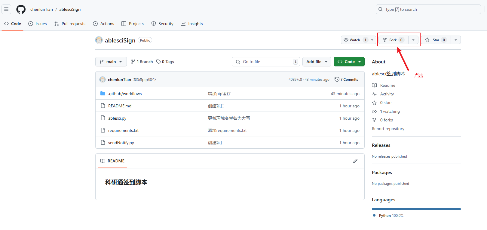
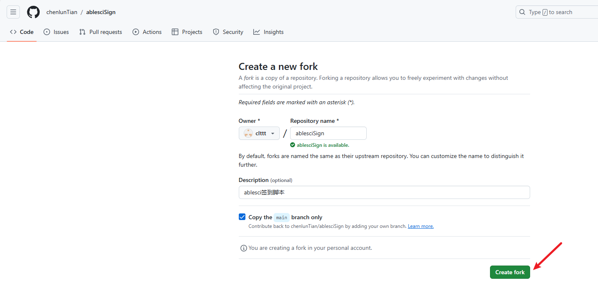
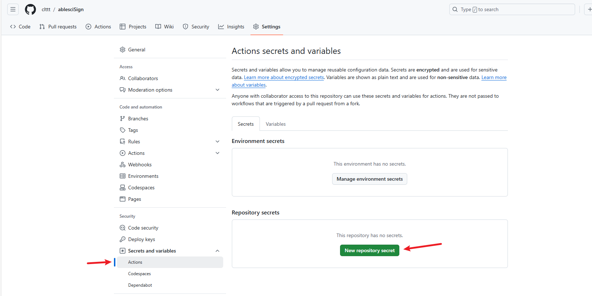
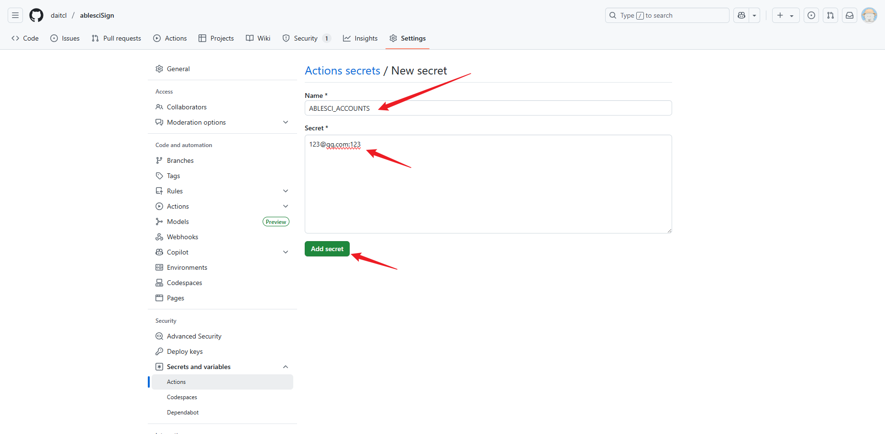
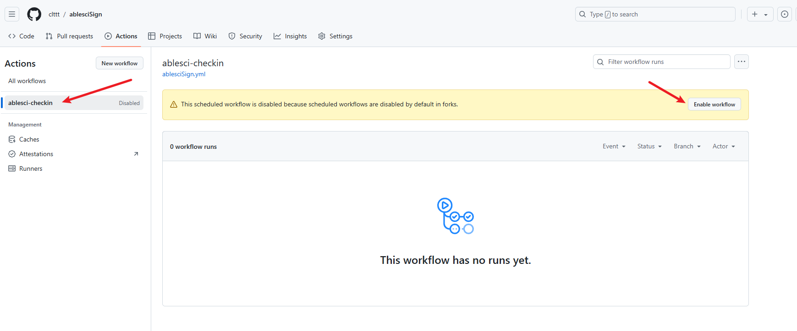

# 科研通自动签到脚本


这是一个用于科研通(AbleSci)网站的自动签到脚本，支持青龙面板和GitHub Actions双平台运行。每日北京时间7点40,21点40，两个时间点自动签到。

## 目录
1. [功能特点](#1-功能特点)
2. [使用方法](#2-使用方法)
    - 2.1 [青龙面板部署](#21-青龙面板部署)
        - 2.1.1 [添加仓库](#211-添加仓库)
        - 2.1.2 [添加环境变量](#212-添加环境变量)
        - 2.1.3 [安装依赖](#213-安装依赖)
    - 2.2 [GitHub Actions 部署](#22-github-actions-部署)
        - 2.2.1 [Fork 仓库](#221-fork-仓库)
        - 2.2.2 [添加 Secrets](#222-添加-secrets)
        - 2.2.3 [启用工作流](#223-启用工作流)
    - 2.3 [手动运行](#23-手动运行)
        - 2.3.1 [青龙面板](#231-青龙面板)
        - 2.3.2 [GitHub Actions](#232-github-actions)
3. [通知配置](#3-通知配置)
    - 3.1 [通知服务说明](#31-通知服务说明)
    - 3.2 [通知服务获取教程](#32-通知服务获取教程)
        - 3.2.1 [Server酱（SCKEY）](#321-server酱sckey)
        - 3.2.2 [息知（XZKEY）](#322-息知xzkey)
        - 3.2.3 [PushPlus（PUSH_PLUS_TOKEN）](#323-pushpluspush_plus_token)
4. [定时任务说明](#4-定时任务说明)
5. [常见问题](#5-常见问题)
    - 5.1 [为什么签到失败？](#51-为什么签到失败)
    - 5.2 [如何接收通知？](#52-如何接收通知)
    - 5.3 [如何修改执行时间？](#53-如何修改执行时间)
    - 5.4 [可以配置多个账号吗？](#54-可以配置多个账号吗)
6. [许可证](#6-许可证)
7. [微信公众号](#7-微信公众号)
8. [赞赏](#8-赞赏)

---

## 1. 功能特点

- 自动登录科研通网站
- 每日自动签到获取积分
- 支持多账号批量签到
- 显示用户信息（用户名、积分、签到天数）
- 支持双平台运行（青龙面板和GitHub Actions）
- 支持多平台消息通知功能

---

## 2. 使用方法

### 2.1 青龙面板部署

#### 2.1.1 添加仓库
1. 进入青龙面板 → 订阅管理
2. 点击"新建订阅"
3. 填写以下信息：
   - 名称：`科研通签到`
   - 类型：`公开仓库`
   - 链接：`https://github.com/daitcl/ablesciSign.git`
   - 定时规则：`40 7,21 * * *`
   - 白名单：`ablesci.py|sendNotify.py`
4. 点击"确定"保存

#### 2.1.2 添加环境变量
1. 进入青龙面板 → 环境变量
2. 点击"新建变量"
3. 添加以下变量：
   - **必需变量**：
     - 名称：`ABLESCI_ACCOUNTS`，值：您的科研通账号列表（格式：邮箱:密码，多个账号用换行或分号分隔）
   - 通知服务变量（可选）：
     - 名称：`SCKEY`，值：您的Server酱SCKEY
     - 名称：`XZKEY`，值：您的息知XZKEY
     - 名称：`PUSH_PLUS_TOKEN`，值：您的PushPlus Token

**账号格式示例**：

```bash
user1@example.com:password1
user2@example.com:password2
user3@example.com:password3
```

#### 2.1.3 安装依赖
在青龙面板的依赖管理中添加以下依赖：
- `requests`
- `beautifulsoup4`

### 2.2 GitHub Actions 部署

#### 2.2.1 Fork 仓库
1. 访问项目页面：https://github.com/daitcl/ablesciSign
2. 点击右上角的 "Fork" 按钮创建您自己的副本




#### 2.2.2 添加 Secrets
1. 在您的仓库页面，点击 "Settings" → "Secrets and variables" → "Actions"
2. 点击 "New repository secret"
3. 添加以下Secrets：
   - **必需Secrets**：
     - Name: `ABLESCI_ACCOUNTS`，Value: 您的科研通账号列表（格式：邮箱:密码，多个账号用换行或分号分隔）
   - 通知服务Secrets（可选）：
     - Name: `SCKEY`，Value: 您的Server酱SCKEY
     - Name: `XZKEY`，Value: 您的息知XZKEY
     - Name: `PUSH_PLUS_TOKEN`，Value: 您的PushPlus Token

**账号格式示例**：

```bash
user1@example.com:password1
user2@example.com:password2
user3@example.com:password3
```


<<<<<<< HEAD



#### 2.2.3 启用工作流
1. 在您的仓库页面，点击 "Actions"
2. 在左侧选择 "AbleSci Auto Sign" 工作流
3. 点击 "Enable workflow" 启用工作流




### 2.3 手动运行

#### 2.3.1 青龙面板
- 在定时任务列表中找到 "科研通签到" 任务
- 点击右侧的运行按钮即可手动执行

#### 2.3.2 GitHub Actions
1. 在您的仓库页面，点击 "Actions"
2. 选择 "AbleSci Auto Sign" 工作流
3. 点击 "Run workflow" 手动执行


---

## 3. 通知配置

### 3.1 通知服务说明
脚本支持多种通知服务：
- **SCKEY**、**XZKEY**、**PUSH_PLUS_TOKEN**：三选一即可，也可以全部配置
- 其他通知服务：可以独立配置或与上述服务组合使用
- 所有通知服务变量都是可选的
- 为避免GitHub Actions报错，建议将所有变量都设置为空字符串（如果需要留空）

### 3.2 通知服务获取教程

#### 3.2.1 Server酱（SCKEY）
1. 访问 [Server酱官网](https://sct.ftqq.com/)
2. 使用GitHub账号登录
3. 进入[发送消息页面](https://sct.ftqq.com/sendkey)
4. 复制您的 `SendKey`（即SCKEY）
5. 在环境变量中设置为 `SCKEY`

#### 3.2.2 息知（XZKEY）
1. 访问 [息知官网](https://xz.qqoq.net/)
2. 注册新账号或使用微信扫码登录
3. 进入[密钥管理页面](https://xz.qqoq.net/#/admin/key)
4. 点击"创建密钥"，填写名称后生成
5. 复制生成的密钥（XZKEY）
6. 在环境变量中设置为 `XZKEY`

#### 3.2.3 PushPlus（PUSH_PLUS_TOKEN）
1. 访问 [PushPlus官网](https://www.pushplus.plus/)
2. 使用微信扫码登录
3. 进入[一对一推送页面](https://www.pushplus.plus/push1.html)
4. 复制"Token"值（即PUSH_PLUS_TOKEN）
5. 在环境变量中设置为 `PUSH_PLUS_TOKEN`

---

## 4. 定时任务说明
脚本默认在以下时间执行：
- 北京时间：7:40 和 21:40
- UTC时间：23:40 和 13:40（对应北京时间次日7:40和21:40）

---

## 5. 常见问题

### 5.1 为什么签到失败？
- 请检查您的账号密码是否正确
- 确保网络连接正常
- 检查科研通网站是否有更新

### 5.2 如何接收通知？
- **GitHub Actions**：
  1. 在仓库Secrets中添加通知服务密钥
  2. 工作流执行后会自动发送通知

- **青龙面板**：
  1. 添加通知服务环境变量
  2. 支持多种通知渠道：Server酱、息知、PushPlus、Telegram等

### 5.3 如何修改执行时间？
- 青龙面板：在定时任务中修改 cron 表达式
- GitHub Actions：在 `.github/workflows/ablesciSign.yml` 中修改 cron 表达式

### 5.4 可以配置多个账号吗？
是的，脚本支持多账号批量签到：
1. **青龙面板**：
   - 设置 `ABLESCI_ACCOUNTS` 环境变量
   - 格式：`邮箱1:密码1[换行]邮箱2:密码2`
2. **GitHub Actions**：
   - 设置 `ABLESCI_ACCOUNTS` Secret
   - 格式：`邮箱1:密码1[换行]邮箱2:密码2`
3. 脚本会自动处理所有账号并发送汇总通知

---

## 6. 许可证
本项目采用 [MIT 许可证](License)

---

## 7. 微信公众号


---

## 8. 赞赏

请我一杯咖啡吧！

