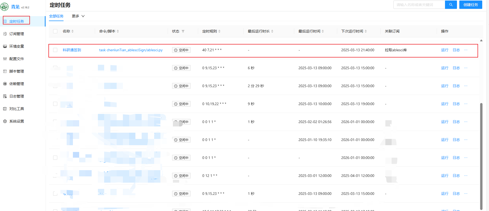
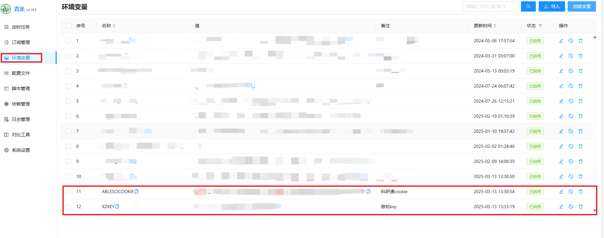

> 可以通过换行添加多个科研通账号的cookie,实现多个账号签到

[TOC]

- [科研通签到脚本](#科研通签到脚本)
- [1.使用教程](#1使用教程)
  - [1.1.方式一 ： Github Actions 部署](#11方式一--github-actions-部署)
      - [1.1.1.注册登录GitHub](#111注册登录github)
      - [1.1.2.Fork项目到自己的Github](#112fork项目到自己的github)
      - [1.1.3.点击 Fork](#113点击-fork)
      - [1.1.4.在自己Fork的项目中启用Actions](#114在自己fork的项目中启用actions)
      - [1.1.5.配置环境变量](#115配置环境变量)
        - [1.1.5.1添加科研通cookie和推送服务secrets(以息知为例)](#1151添加科研通cookie和推送服务secrets以息知为例)
      - [1.1.6.运行Actions](#116运行actions)
        - [1.1.6.1运行成功时，息知推送提醒](#1161运行成功时息知推送提醒)
  - [1.2. 方式二：在青龙面板中添加拉库定时任务](#12-方式二在青龙面板中添加拉库定时任务)
    - [1.2.1. 方式一：订阅管理](#121-方式一订阅管理)
    - [1.2.2. 方式二：定时任务拉库](#122-方式二定时任务拉库)
    - [1.2.3 检查定时任务](#123-检查定时任务)
    - [1.2.4 配置环境变量](#124-配置环境变量)
    - [1.2.5 运行](#125-运行)
- [2.登录科研通获取cookie](#2登录科研通获取cookie)
- [3. 获取推送secrets](#3-获取推送secrets)


## 科研通签到脚本

每日北京时间7点40,21点40，两个时间点自动签到

## 1.使用教程


### 1.1.方式一 ： Github Actions 部署

##### 1.1.1.注册登录GitHub

自行百度

##### 1.1.2.Fork项目到自己的Github

打开[Github](https://github.com/chenlunTian/ablesciSign)  项目地址: https://github.com/chenlunTian/ablesciSign

##### 1.1.3.点击 Fork 


##### 1.1.4.在自己Fork的项目中启用Actions


##### 1.1.5.配置环境变量


###### 1.1.5.1添加科研通cookie和推送服务secrets(以息知为例)


同样的方式添加息知**secrets**

最终结果如下图。


> 注：必须是 
>
> ​	ABLESCICOOKIE 
>
> ​	XZKEY

##### 1.1.6.运行Actions

点击 **Actions** -> **ablesci-checkin** ->  **Run workflow** ->  **Run workflow** ,即可运行。

运行成功则如下图所示。


> 注：运行失败时，则显示红色。此时请检查错误日志。

###### 1.1.6.1运行成功时，息知推送提醒


> 注：如未收到 息知提醒 请检查 息知secrets是否填写正确 及 是否关注 息知公众号


### 1.2. 方式二：在青龙面板中添加拉库定时任务

两种方式，任选其一即可：

#### 1.2.1. 方式一：订阅管理

```
名称：拉取ablesci库
类型：公开仓库
链接：https://github.com/chenlunTian/ablesciSign.git
定时类型：crontab
定时规则：2 2 28 * *
白名单：ablesci
```

没提到的不要动。

保存后，点击运行按钮，运行拉库。

#### 1.2.2. 方式二：定时任务拉库

青龙面板，`定时任务`页，右上角`添加任务`，填入以下信息：

```
名称：拉取ablesci库
命令：ql repo https://github.com/chenlunTian/ablesciSign.git "ablesci" 
定时规则：2 2 28 * *
```

点击确定。

保存成功后，找到该定时任务，点击运行按钮，运行拉库。

#### 1.2.3 检查定时任务

如果正常，拉库成功后，会自动添加科研通签到的task任务。



#### 1.2.4 配置环境变量

青龙面板，`环境变量`页，右上角`创建变量`，填入以下信息：

科研通cookie
```
名称：ABLESCICOOKIE 
自动拆分：否
值：`科研通cookie`
备注：科研通cookie
```
息知key
```
名称：XZKEY 
自动拆分：否
值：`息知key`
备注：息知key
```
如果正常，环境变量页面如图。

#### 1.2.5 运行

青龙面板，`定时任务`页，找到 `科研通签到`，点击 `运行`


如果正常会收到息知推送提醒


> 注：如未收到 息知提醒 请检查 息知secrets是否填写正确 及 是否关注 息知公众号

## 2.登录科研通获取cookie

登录网站，打开调试模式，快捷键<kbd>F12</kbd>，依次选择 

<kbd>网络</kbd> -> <kbd>保留日志</kbd> -> <kbd>刷新界面 </kbd>-> 点击<kbd> https://www.ablesci.com/</kbd> -> 复制 <kbd>cookie</kbd> 


## 3. 获取推送secrets

打开[息知](https://xz.qqoq.net/#/index) 网站首页: https://xz.qqoq.net/#/index

```bash
https://xizhi.qqoq.net/{key}.send?title=标题&content=内容
```

> 其中**key**即需要获取的**secrets**

扫码登录 


